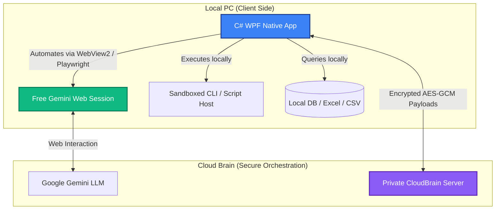

# 🤖 DWN.BRIDGE

<!-- VERSION_BADGE --> *Sync based on Private Release: **v1.0.0.36***

> "Faceless. Nameless. I just build the simulation. 'I can only show you the door. You're the one that has to walk through it.'" 💊

---

**DWN.BRIDGE** is an open-source, developer-first native Windows client that turns your free web-based LLMs (like Google Gemini) into fully autonomous local agents with **zero API costs** and **100% raw data privacy**.

Instead of paying for expensive cloud API tokens that burn through your budget, **DWN.BRIDGE** leverages a native WebView2/Playwright bridge to safely automate your browser session. It exposes a sandboxed local environment to the AI, allowing it to read/write files, write code, and query local databases while keeping your sensitive raw data on your own machine.

### 🌐 [ClickOnce Installer](https://www.dwnbridge.org/) | 🌐 [GitHub Mirror](https://marckdwn.github.io/DWN.BRIDGE/) | 📄 [Security Logs / Blog](https://www.dwnbridge.org/blog/) | 📺 [Demo Channel](https://www.youtube.com/@MarckDwn) | 💬 [Join Discord](https://discord.gg/45W4KDue8a)

[](https://www.youtube.com/watch?v=dCtOsXAuPgc)

---

## ✨ Features

- **📉 Optimized Operational Costs**: Leverage the native capabilities of public web chat interfaces (such as Google Gemini, ChatGPT, and Claude) to orchestrate agentic workflows, drastically reducing typical API dependency and operational overhead.
- **🔒 Zero-Knowledge Privacy**: When querying databases (SQL Server, PostgreSQL, Excel, CSV), the client parses metadata/schemas locally and sends *only the schema* to the LLM. The LLM generates the query, and the client executes it locally. Your raw data never leaves your hard drive.
- **🛠️ Local Tool Integration**: Exposes filesystem operations (`READ_FILE`, `WRITE_FILE`), system commands (`RUN_COMMAND`), and SQL execution directly to the web chat session.
- **🤖 Custom Markdown Agents**: Author custom agents using simple Markdown profiles. Just describe their personality, list their tools, and publish them to your local directory.
- **⚡ High-Performance Native UI**: Written in C# WPF, optimized for low resource usage compared to bloated Electron-based alternatives.
- **🌍 Multilingual support**: Complete interface localized in 9 languages (EN, IT, ES, FR, DE, ZH, RU, JA, KO, PT).

---

## 📐 How it Works (Architecture)



1. **Browser Bridge**: The client uses a stealth browser-automation layer to establish a direct link with your free Gemini Web UI.
2. **Encrypted Communication**: The client communicates with the private CloudBrain orchestrator via AES-GCM encrypted payloads to sync prompts and context safely.
3. **Local Action execution**: When the LLM requests a tool call (e.g. running a script or fetching directory contents), the client intercepts the request, runs it locally, and feeds the output back into the chat.

---

## 🛠️ How to run (Hacker Mode)

If you prefer to compile the client from source rather than using the pre-compiled installer:

### Prerequisites
- .NET 10 SDK

### Steps
1. Clone this repository:
   ```bash
   git clone https://github.com/MarckDWN/DWN.BRIDGE.git
   ```
2. Open `AIBridge.sln` in Visual Studio or Rider.
3. Build and run the `AIBridge` project in `Debug` or `Release` mode.

---

## 🤝 Community Agents
We welcome and encourage custom agent profiles! You can map dynamic tools and create personalized assistants. 
Simply define your agent in a `.md` file, place it in the custom agent directory:
`%AppData%\Local\AIBridge\customagents\<your-user-email>\`
and refresh the UI to test it!

---

## 🤝 Contributing
We are looking for co-maintainers and contributors to help build new database drivers, refine the C# WPF UI, and optimize local sandboxing. Please read our [CONTRIBUTING.md](file:///c:/Users/orlan/source/repos/AIBridge/CONTRIBUTING.md) guide to get started!

---

## ⚖️ License
This project is licensed under the MIT License. See the LICENSE file for details.

